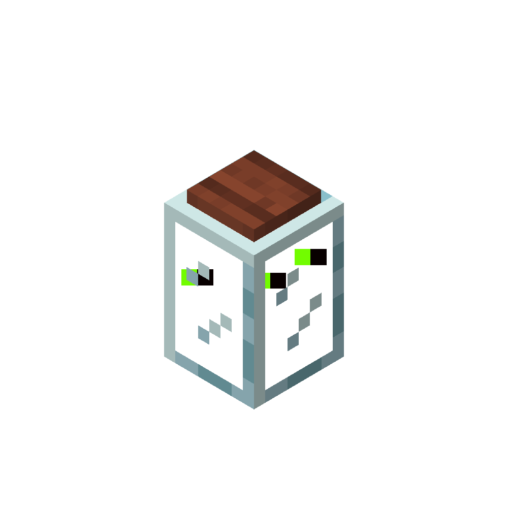

!!! infobox inline end "Firefly Jar"
    

This page only contains the info about the firefly jar that is different from the jar. For the rest of the info, see [the regular jar page](./jar.md).

The more fireflies in the jar, the more light it lets off, however, tinted glass firefly jars don't emit any light.

## Recoloring
When you click on fireflies with dye, they blend with the color of the dye, similarly to leather armor, this allows changing fireflies to any color. You can also rename fireflies to certain names, which have special sets of multiple colors. Some of these names are listed below, but there are some secret ones (Hint: Try some usernames)

| Name | Colors |
| ---- | ------ |
| Pride | *#e40303*{color}, *#ff8c00*{color}, *#ffed00*{color}, *#008026*{color}, *#24408e*{color}, *#732982*{color} |
| Trans | *#5bcefa*{color}, *#f5a9b8*{color}, *#ffffff*{color} |
| Bi | *#d60270*{color}, *#9b4f96*{color}, *#0038a8*{color} |
| Pan | *#ff218c*{color}, *#ffd800*{color}, *#21b1ff*{color} |
| Lesbian | *#d52d00*{color}, *#ef7627*{color}, *#ff9a56*{color}, *#ffffff*{color}, *#d162a4*{color}, *#b55690*{color}, *#a30262*{color} |
| Genderfluid | *#ff76a4*{color}, *#ffffff*{color}, *#c011d7*{color}, *#000000*{color}, *#2f3cbe*{color} |
| Asexual | *#000000*{color}, *#a3a3a3*{color}, *#ffffff*{color}, *#800080*{color} |
| Aromantic | *#3da542*{color}, *#a7d379*{color}, *#ffffff*{color}, *#a9a9a9*{color}, *#000000*{color} |
| Nonbinary | *#fcf434*{color}, *#ffffff*{color}, *#9c59d1*{color}, *#000000*{color} |

## Block State
The firefly in additon to the regular cover blockstate, has a `light_level` property which is a number from 1 - 15, which determines the light level of the firefly. This corresponds to the light level emitted by the firefly jar, and can be increased by either clicking on the jar with a firefly bottle, or by clicking the jar on a firefly swarm. The light level can be decreased by clicking on the jar with a empty bottle.