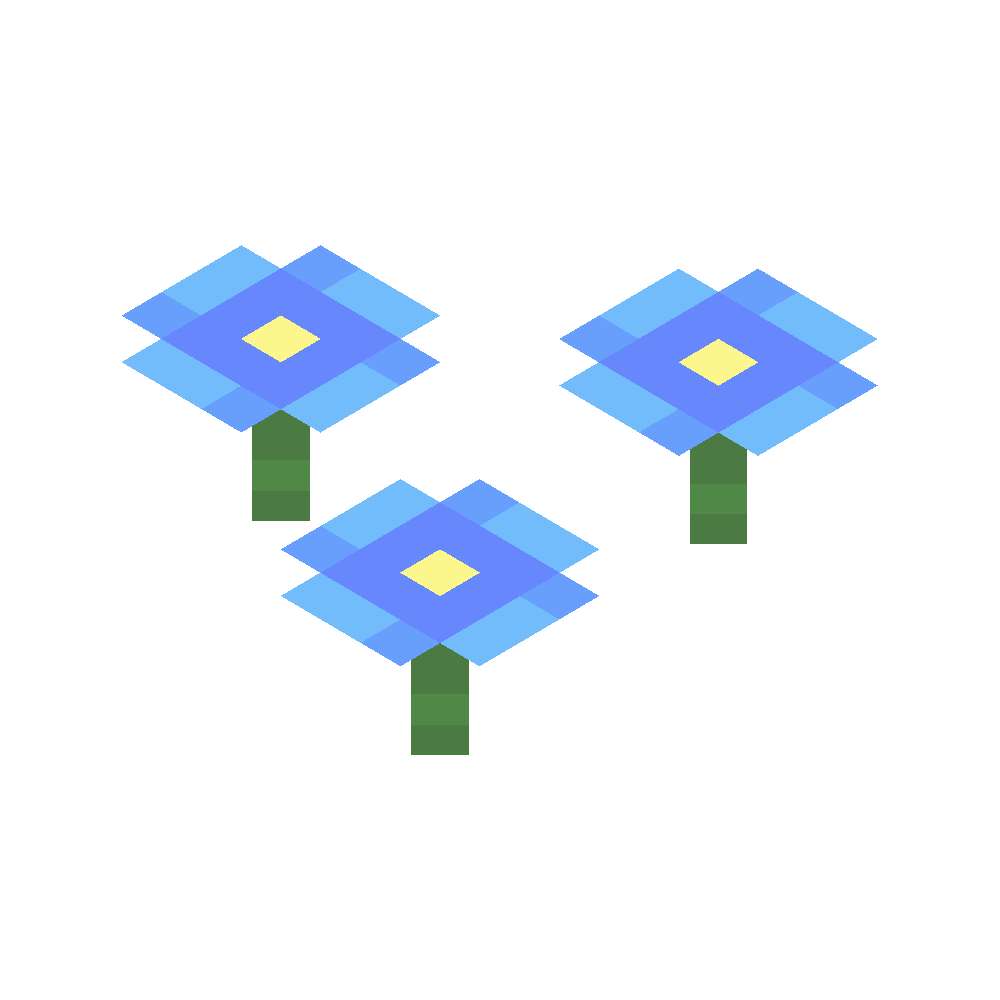
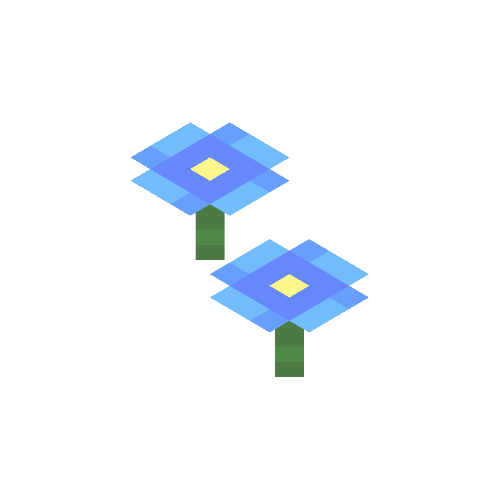
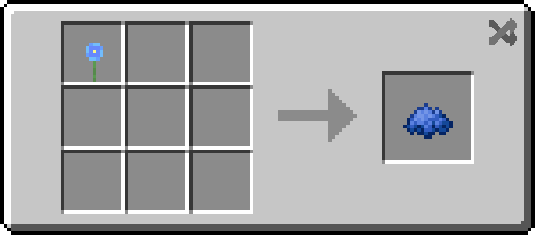
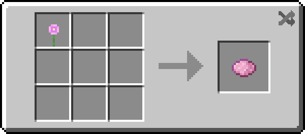
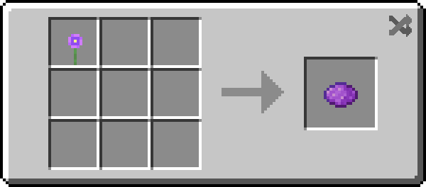
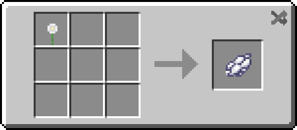

!!! infobox inline end "Forget Me Nots"
    === "Triple"
        { carousel=4 }
    === "Double"
        { carousel=4 }
    === "Single"
        { carousel=4 }
    

    

        **Renewable**
        Yes
    

    

        **Stackable**
        64
    

    

        **Tool**
        Any tool
    

    

    **Blast Resistance**
    0
    

    

    **Hardness**
    0
    

    

    **Luminous**
    No
    

    

    **Transparent**
    Yes
    

    

    **Flammable**
    No
    

    

    **Catches fire from lava**
    No
    

Forget me nots are type of [flower](https://minecraft.fandom.com/wiki/Flower) found in birch forest biomes. They can have up to three flowers in a single block, and can have multiple different colors in a single block. They can also be crafted into dyes.

## Obtaining

### Natural generation
Forget me nots spawn in birch forest biomes.

### Bone meal
Using bone meal on grass while in a birch forest biome will spawn forget me nots instead of other flowers.

## Usage

###  Crafting ingredient
| Name       | Ingredients          | Crafting recipe                                                                 | Description |
| ---------- | -------------------- | ------------------------------------------------------------------------------- | ----------- |
| Blue Dye   | Blue Forget Me Not   |      |             |
| Pink Dye   | Pink Forget Me Not   |      |             |
| Purple Dye | Purple Forget Me Not |  |             |
| White Dye  | White Forget Me Not  |    |             |

### Suspicious stew
Just like other flowers, forget me nots can be used to craft suspicious stew. The status effect forget me nots give is luck.