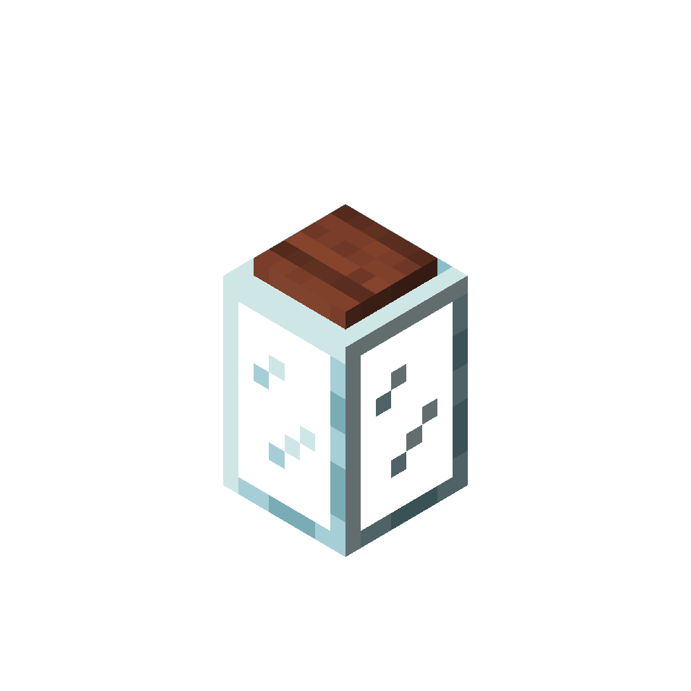
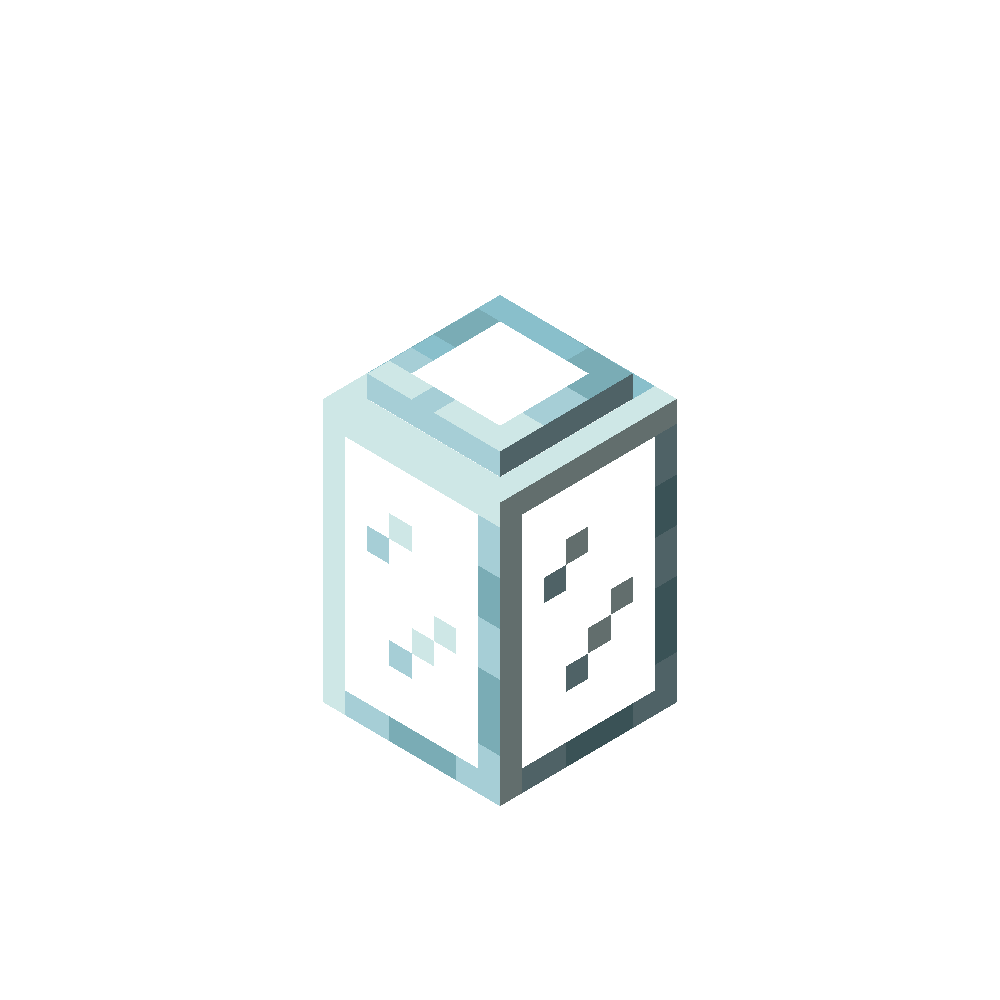
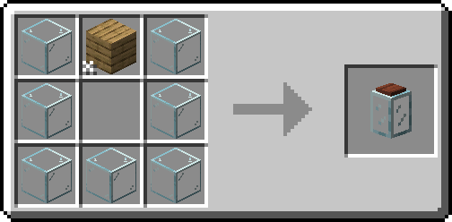

!!! infobox inline end "Jar"
    === "Covered Jar"
        
    === "Uncovered Jar"
        
    

    

        **Renewable**
        Yes
    

    

        **Stackable**
        64
    

    

        **Tool**
        Any tool
    

    

    **Blast Resistance**
    2.0
    

    

    **Hardness**
    2.0
    

    

    **Luminous**
    No
    

    

    **Transparent**
    Yes
    

    

    **Flammable**
    No
    

    

    **Catches fire from lava**
    No
    

The jar is a decoration and utility block. It can be used to store food, and to [store fireflies](./firefly_jar.md) or to [store food](./food_jar.md)

## Obtaining

### Crafting
| Ingredients | Crafting recipe |
| ----------- | --------------- |
| Any one type of glass + Any planks in the `minecraft:planks` tag |  |

## Usage

### Storing food
When clicked with any food item not in the `missingwilds:food_jar_blacklist` tag, the jar will store the food item, up to a maximum of 12 items.

When clicked with an empty hand, one item will go back into the player's inventory.

### Storing fireflies
When clicked with a firefly bottle, the jar will store the firefly, and the jar will become a [firefly jar](./firefly_jar.md). Each level of fireflies in the jar will increase the light level of the jar by 1, up to a maximum of 15.

When clicked with a empty bottle, the bottle will take away one level of fireflies from the jar.