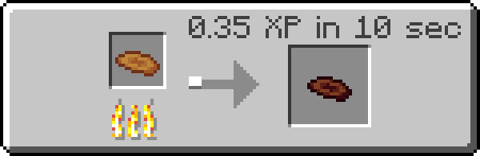

!!! infobox inline end "Polypore Mushroom"
    
    

    

        **Rarity**
        Common
    

    

        **Renewable**
        Yes
    

    

        **Stackable**
        64
    

    

        **Restores**
        1 :minecraft_food:
    

Food item gotten through cooking [polypore mushrooms](polypore_mushroom.md).

## Obtaining

### Cooking
Roasted polypore mushrooms can be created by cooking [polypore mushrooms](polypore_mushroom.md) in a furnace, smoker, or campfire.

| Name                      | Ingredients                  | Recipe                                                                                                              |
| ------------------------- | ---------------------------- | ------------------------------------------------------------------------------------------------------------------- |
| Roasted Polypore Mushroom | Polypore Mushroom + Any fuel |  |